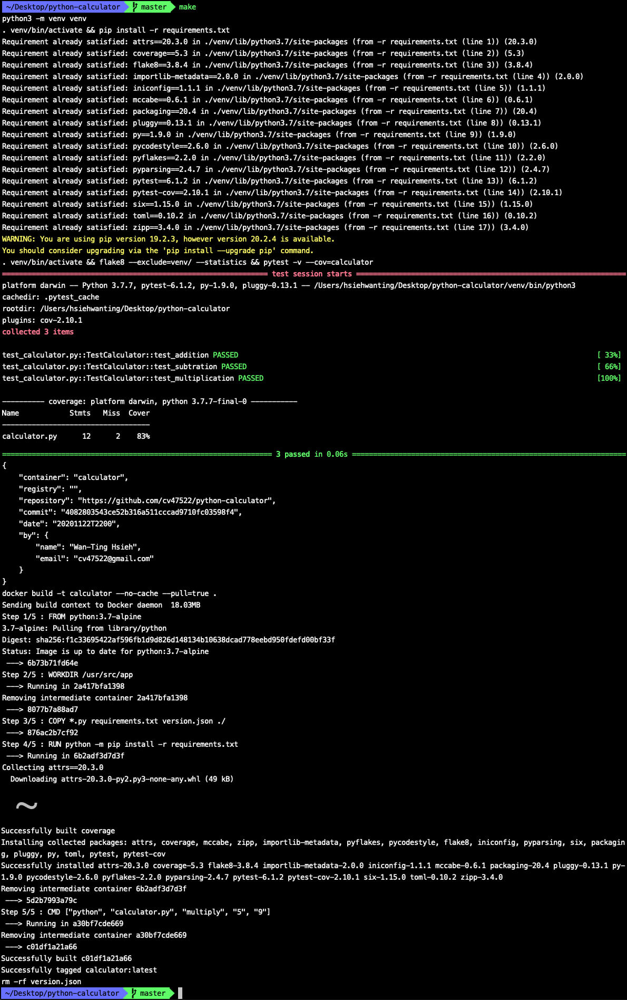
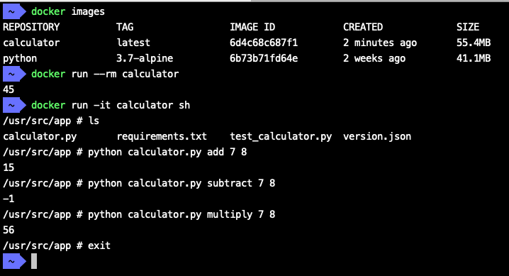

# Python Calculator CI Practice 
[](https://circleci.com/gh/cv47522/python-calculator)

## Tools

- Python Modules
  - **[Flake8](https://flake8.pycqa.org/en/latest/)** Linting: check if your code conforms to the standard Python coding style

  - **[Pytest](https://docs.pytest.org/en/latest/)** unit testing: check a single function, or unit, of code

  - **Pytest-cov** calculating code coverage: code coverage is the percentage of source code that is “covered” by your tests

- External CI Server: [CircleCI](https://circleci.com/)
- [Docker](https://www.docker.com/)

## Usage

1. clone the repository:`git clone https://github.com/cv47522/python-calculator && cd python-calculator`

2. run `make` for automatic CI checking and docker image building


3. run the built image: `docker run --rm calculator` will output `45` whose command is defined in the **Dockerfile** (`CMD ["python", "calculator.py", "multiply", "5", "9"]`)

4. or access the built image in the interactive mode and run the custom functions:

```bash
docker run -it calculator sh
/usr/src/app \# python calculator.py add 7 8
# 15
/usr/src/app \# python calculator.py subtract 7 8
# -1
/usr/src/app \# python calculator.py multiply 7 8
# 56
/usr/src/app \# exit
```


